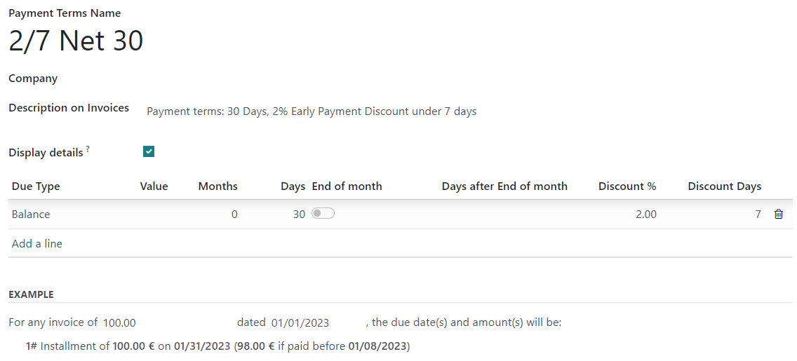

================================
Cash discounts and tax reduction
================================

**Cash discounts** are reductions in the amount a customer must pay for goods or services, offered
as an incentive for paying their invoice promptly. These discounts are typically a percentage of the
total invoice amount, and are applied if the customer pays within a specified time period. The
purpose of offering cash discounts is to encourage customers to pay their bills quickly, which can
help the company maintain a steady cash flow.

.. example::
   You issue a €100 invoice on the 1st of January. The full payment is due within 30 days, and you
   also offer a 2% discount if your customer pays you within seven days.

   The customer can pay €98 up to the 8th of January. After that date, they would have to pay €100
   by the 31st of January.

Depending on the country or region, a :ref:`tax reduction <cash-discounts/tax-reductions>`, can be
applied as well.

.. _cash-discounts/configuration:

Configuration
=============

To grant cash discounts to customers, you must first set up the :ref:`type of tax reduction
<cash-discounts/tax-reductions>`, verify the :ref:`gain and loss accounts
<cash-discounts/gain-loss-accounts>`, and configure new :ref:`payment terms
<cash-discounts/payment-terms>`.

.. _cash-discounts/tax-reductions:

Tax reductions
--------------

Depending on the country or region, the base amount used to compute the tax can vary, which can lead
to a **tax reduction**.

To configure how the tax reduction is applied, go to :menuselection:`Accounting --> Configuration
--> Settings`, and in the :guilabel:`Cash Discount Tax Reduction` feature, select one of the three
following options:

Always (upon invoice)
  The tax is always reduced. The base amount used to compute the tax is the discounted amount,
  whether the customer benefits from the discount or not.

On early payment
  The tax is reduced only if the customer pays early. The base amount used to compute the tax is the
  same as the sale: if the customer benefits from the reduction, then the tax is reduced. This means
  that, depending on the customer, the tax amount can vary after the invoice is issued.

Never
  The tax is never reduced. The base amount used to compute the tax is the full amount, whether the
  customer benefits from the discount or not.

.. example::

   You issue a €100 invoice (tax-excluded) on the 1st of January, with a 21% tax rate. The full
   payment is due within 30 days, and you also offer a 2% discount if your customer pays you within
   seven days.

   .. tabs::

      .. tab:: Always (upon invoice)

         .. list-table::
            :header-rows: 1

            * - Due date
              - Total amount due
              - Computation
            * - 8th of January
              - €118.58
              - (€98 + (21% of €98))
            * - 31st of January
              - €120.58
              - (€100 + (21% of €98))

      .. tab:: On early payment

         .. list-table::
            :header-rows: 1

            * - Due date
              - Total amount due
              - Computation
            * - 8th of January
              - €118.58
              - (€98 + (21% of €98))
            * - 31st of January
              - €121.00
              - (€100 + (21% of €100))

      .. tab:: Never

         .. list-table::
            :header-rows: 1

            * - Due date
              - Total amount due
              - Computation
            * - 8th of January
              - €119.00
              - (€98 + (21% of €100))
            * - 31st of January
              - €121.00
              - (€100 + (21% of €100))

.. note::
   - :ref:`Tax grids <tax-returns/tax-grids>`, which are used for the tax report, are correctly
     computed, according to the :ref:`type of tax reduction <cash-discounts/tax-reductions>` you
     configured.
   - The **type of cash discount tax reduction** may be correctly pre-configured, depending on your
     :ref:`fiscal localization package <fiscal_localizations/packages>`.

.. _cash-discounts/gain-loss-accounts:

Cash discount gain/loss accounts
--------------------------------

With a cash discount, the amount you earn depends on whether the customer benefits from the cash
discount or not. This inevitably leads to gains and losses, which are recorded on default accounts.

To modify these accounts, go to :menuselection:`Accounting --> Configuration --> Settings` and, in
the :guilabel:`Default Accounts` section, select the accounts you want to use for the
:guilabel:`Cash Discount Gain account` and :guilabel:`Cash Discount Loss account`.

.. _cash-discounts/payment-terms:

Payment terms
-------------

Your cash discounts can be applied on customer invoices with :doc:`payment terms <payment_terms>`.
Configure it to your liking and make sure to fill out the fields :guilabel:`Discount %` and
:guilabel:`Discount Days`.

         reads: "Payment terms: 30 Days, 2% Early Payment Discount under 7 days".

.. seealso::
  - :doc:`payment_terms`

.. _cash-discounts/customer-invoice:

Apply a cash discount to a customer invoice
===========================================
