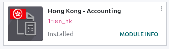
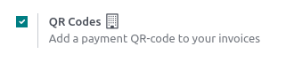
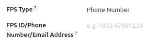
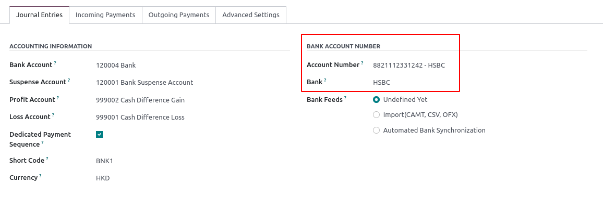
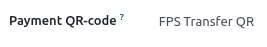
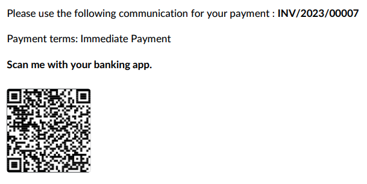

=========
Hong Kong
=========

Configuration
=============

:ref:`Install <general/install>` the :guilabel:`Hong Kong - Accounting` module to
get the features of the HK localization.

Add FPS QR Codes to invoices
============================

Activate QR Code feature
------------------------

Go to :menuselection:`Accounting --> Configuration --> Settings`
and activate the **QR Code** feature.

Configure your FPS bank account
-------------------------------

Go to :menuselection:`Contacts --> Configuration --> Bank Accounts`,
select a Account Holder with Hong Kong as country, open your FPS bank
account and fill in the **FPS Type** and **FPS ID/Phone Number/Email
Address** fields.

Configure your Bank Account's journal
-------------------------------------

Go to :menuselection:`Accounting --> Configuration --> Journals`, open your
bank journal, then fill out the Account Number and Bank under the Journal
Entries tab.

Issue Invoices with FPS QR Codes
--------------------------------

To enable the FPS QR Code on your invoices, go to :menuselection:`Accounting
--> Customers --> Invoices`, and create a new invoice.

Open the *Other Info* tab and select the *Payment QR-code* option to
*FPS Transfer QR*.

Also check the *Recipient Bank* field and make sure that the account indicated
is the one you want to use to receive your customer's payment.

