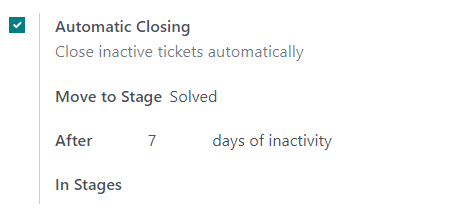
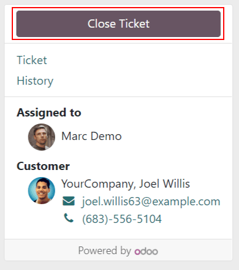

===============
Closing Tickets
===============

Once work has been completed on a :guilabel:`Helpdesk` ticket, there are several ways it can be
closed. Automatically closing inactive tickets ensures the pipeline is up to date. Allowing
customers to close their own tickets gives them autonomy, and minimizes confusion around when an
issue is considered solved or not. This results in increased operational capacity for support teams,
and higher satisfaction for the customer.

Manually closing tickets
========================

As work on a ticket progresses, it is moved along to the next stage in the pipeline. When the work
is complete, it is moved to a folded stage, to signify the work has been completed. This marks the
ticket as *closed*.

.. important::
   When a stage is set to *folded* in the kanban view, the tickets in that stage are considered
   *closed*. To fold a stage, go to :menuselection:`Helpdesk --> Configuration --> Stages`.
   Select a stage to edit, and check the :guilabel:`Folded in Kanban` checkbox.

   .. image:: close_tickets/closing_folded_setting.png
      :align: center
      :alt: Stage settings page

Automatic closing
=================

Tickets that are inactive for a set period of time can be automatically closed. At that point,
they will be moved to a folded stage.

Go to the team's settings page by going to :menuselection:`Helpdesk --> Configuration --> Teams`.
Under the :guilabel:`Self-Service` section, enable :guilabel:`Automatic Closing`.

If one of the team's stages is set to be folded in the kanban view, it will be the default selection
in the :guilabel:`Move to Stage` field. If the team has more than one folded stage, the stage that
occurs first in the pipeline will be the default. If no stage is set to be folded, the default
selection will be the last stage in the pipeline.

Adjust the :guilabel:`After days of inactivity` field to the appropriate number of days.

.. important::
   The :guilabel:`After days of inactivity` field does not take the working calendar into account
   when tracking time.

If only certain stages should be used to track days of inactivity, they can be added in the
:guilabel:`In Stages` field.

.. example::
   A pipeline has the following stages:

   - New
   - In Progress
   - Customer Feedback
   - Closed

   Tickets may linger in the *Customer Feedback* stage, because once an issue is solved, customers do
   not respond right away. At that point, they can be closed automatically. However, tickets in the
   *New* and *In Progress* stages may remain inactive due to assignment or workload issues. Closing
   them automatically may result in issues going unsolved.

   Therefore, the :guilabel:`Automatic Closing` settings would be configured as below\:\

   .. image:: close_tickets/closing_example.png
      :align: center
      :alt: Example Automatic Closing settings

Closure by customers
====================

The :guilabel:`Closure by Customers` setting allows customers to close their own tickets when they
determine the issue is resolved.

Start by navigating to :menuselection:`Helpdesk --> Configuration --> Teams` and choose
the appropriate team. Scroll to the :guilabel:`Self-Service` section and check the box for
:guilabel:`Closure by Customers`.

.. image:: close_tickets/closing_bycustomer_setting.png
   :align: center
   :alt: Customer closing setting in Odoo Helpdesk.

Once the ticket closing settings are enabled, a :guilabel:`Close Ticket` button will be available
for customers when they view their ticket.

