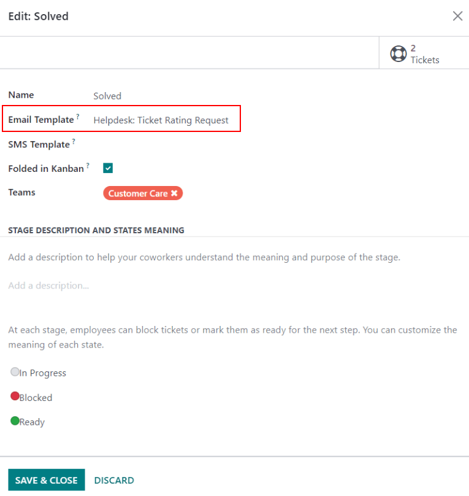
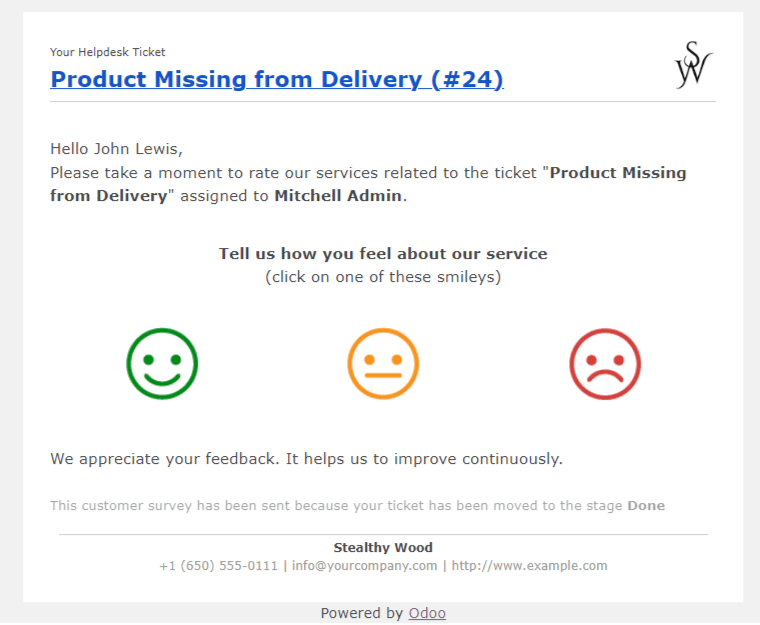
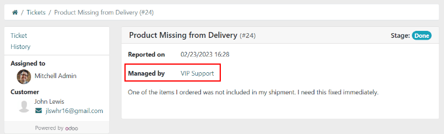
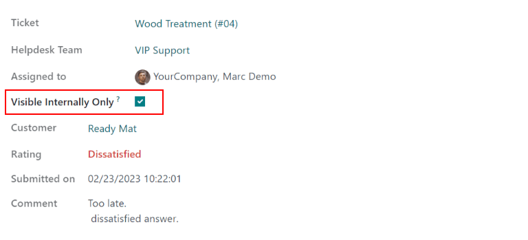

=======
Ratings
=======

Asking customers to rate their experience with :guilabel:`Helpdesk` support provides the opportunity
to gauge team performance, and track customer satisfaction. Ratings can published to the portal,
providing customers with a statistical overview of the team's performance.

Set up
======

To enable :guilabel:`Customer Ratings`, go to :menuselection:`Helpdesk --> Configuration --> Teams`.
Select a team, scroll to :guilabel:`Performance`, and select :guilabel:`Customer Ratings`.

.. image:: ratings/ratings_enable.png
   :align: center
   :alt: Overview of the settings page of a helpdesk team emphasizing the rating on ticket feature
         in Odoo Helpdesk

To automatically request ratings from customers once a ticket has closed, an email template must
be added to the appropriate stage. Click the :guilabel:`Set an Email Template on Stages` button.
Select a :guilabel:`Stage`.

.. important::
   Customers should only be asked to rate tickets once their issue has been resolved and their ticket
   is closed. Therefore, a *Ratings Request* email should only be added to a stage that is
   :guilabel:`Folded in Kanban`, as tickets in a folded stage are considered closed.

Select an email template, or create a new one. Click :guilabel:`Save & Close`. Now, once a ticket
reaches the folded stage an email is sent to the customer requesting a rating.

After selecting an icon, customers are taken to a webpage where they can provide specific written
feedback. Once a rating is submitted, it is added to the chatter on the ticket.

.. tip::
   Customer ratings can also be viewed through the :guilabel:`Customer Ratings` report. To view this
   report, go to :menuselection:`Helpdesk --> Reporting --> Customer Ratings`.

Publish ratings on the customer portal
======================================

Once the :guilabel:`Customer Ratings` setting has been enabled, users have the option to share
ratings to the customer portal. Enabling this setting provides portal users with access to customer
satisfaction statistics. Only the ratings themselves will be included, not to the written feedback..

.. important::
   In order to display ratings on the customer portal, a team has to be be visible to
   :guilabel:`Invited portal users and all internal users`. This setting is configured on the team's
   settings page under :guilabel:`Visibility`.

Go to :menuselection:`Helpdesk --> Configuration --> Teams` and enable
:guilabel:`Display Rating on Customer Portal`.

         in Odoo Helpdesk

Now, by clicking on the helpdesk team's name on their ticket, customers can see its ratings.

.. image:: ratings/ratings_portal_overview.png
   :align: center
   :alt: View of the ratings performance overview from the customer portal

Manually hide individual ratings
--------------------------------

Individual ratings can be manually hidden from the portal.

Navigate to the page for a rating. This can be done in one of the following ways:

   - By clicking on the :guilabel:`Rating` smart button at the top of a closed ticket.
   - Go to :menuselection:`Helpdesk --> Reporting --> Customer Ratings`.

Click the :guilabel:`Visible Internally Only` check box.

.. seealso::
   - :doc:`../advanced/close_tickets`
   - :doc:`../overview/reports`
